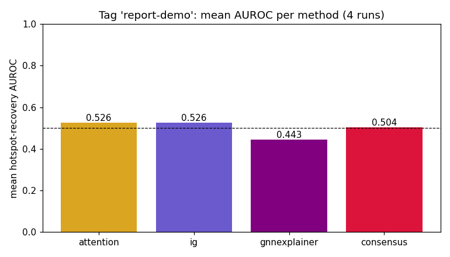

# attrib-PINCH — report for tag `report-demo`

_Experiment_ `pinch-ppi-xai` · _4 runs_ · generated 2026-06-07 23:39

## Mean AUROC per method (across the tag group)

| Method | mean AUROC |
|---|---|
| attention | 0.526 |
| ig | 0.526 ⬅ best |
| gnnexplainer | 0.443 |
| consensus | 0.504 |

## Per-run detail

| run | train_acc | measured | hotspots | ig_delta_max | AUROC_attention | AUROC_ig | AUROC_gnnexplainer | AUROC_consensus | dropout | wd | augment | ig_steps |
|---|---|---|---|---|---|---|---|---|---|---|---|---|
| sweep d=0.0 wd=0e+00 | 1.00 | 64 | 24 | 19.13 | 0.476 | 0.557 | 0.508 | 0.456 | 0.00 | 0.000 | 6 | 50 |
| sweep d=0.3 wd=1e-03 | 1.00 | 64 | 24 | 6.85 | 0.520 | 0.357 | 0.362 | 0.450 | 0.30 | 0.001 | 6 | 50 |
| sweep d=0.3 wd=1e-02 | 0.20 | 64 | 24 | 0.00 | 0.553 | 0.559 | 0.500 | 0.577 | 0.30 | 0.010 | 6 | 50 |
| sweep d=0.5 wd=1e-02 | 0.20 | 64 | 24 | 0.00 | 0.553 | 0.630 | 0.402 | 0.531 | 0.50 | 0.010 | 6 | 50 |

## Read

- Best method on average for this tag: **ig** (mean AUROC 0.526).
- Consensus mean AUROC: **0.504** (vs random 0.5).
- The **consensus hypothesis** does NOT lead here.
- Largest labelled set in any run: **64 residues**. At this scale AUROC is high-variance — treat differences of <0.1 as noise, and prefer tags with more runs / more complexes.
- ⚠️ Fewer than 100 labelled residues: this is still the toy/demo regime. For a real verdict, scale the dataset (more complexes, or PINDER — option *b*).
