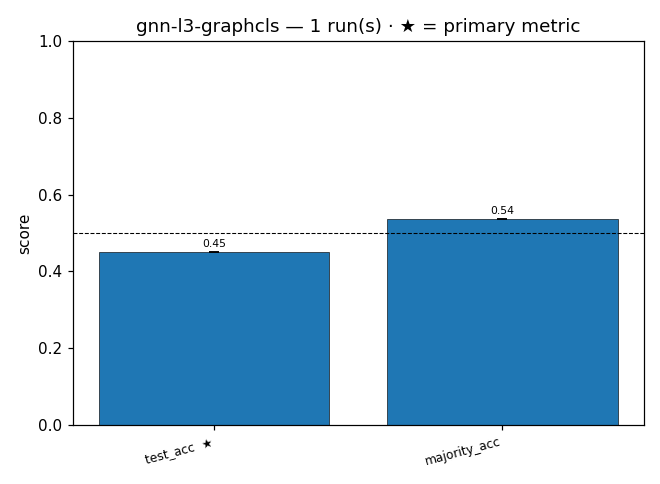
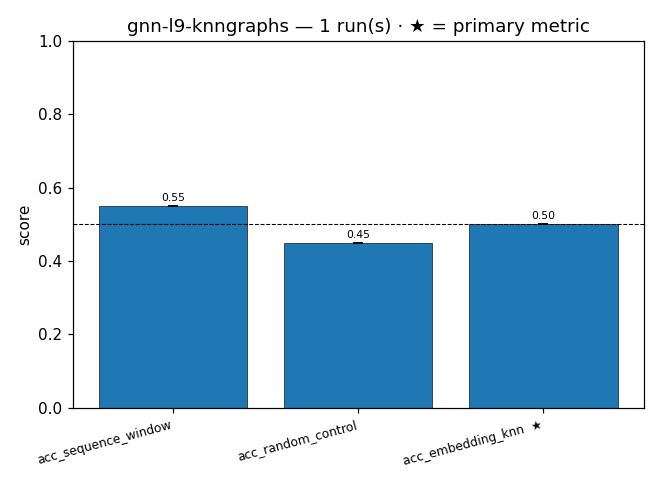

# Campaign report — `gnn-smoke-2026-06-08`

_2 runs across 2 experiment(s)_ · generated 2026-06-08 20:44

## Experiments

- [`gnn-l3-graphcls`](#gnn-l3-graphcls) — 1 run, primary `test_acc`
- [`gnn-l9-knngraphs`](#gnn-l9-knngraphs) — 1 run, primary `acc_embedding_knn`

## gnn-l3-graphcls

**Why:** Smoke: does the GAT one-hot graph classifier clear the majority baseline on solubility at tiny N?

_1 run · primary metric_ `test_acc` · _swept_ (none)

| config | n | test_acc | majority_acc |
|---|---|---|---|
| `4e3cd7c3` ⬅ | 1 | 0.450 | 0.537 |

**Best config:** `model=GAT, n_test=40, dataset=proteinea/solubility, n_train=80, batch_size=8, hidden=64, epochs=3, heads=4, lr=0.0005, window=3, features=one-hot` → test_acc = 0.450

## gnn-l9-knngraphs

**Why:** Smoke: do embedding-kNN graphs beat sequence-window and random-control graphs on solubility at tiny N?

_1 run · primary metric_ `acc_embedding_knn` · _swept_ (none)

| config | n | acc_sequence_window | acc_random_control | avg_edges_knn | acc_embedding_knn | avg_edges_seq |
|---|---|---|---|---|---|---|
| `f2f40ef8` ⬅ | 1 | 0.550 | 0.450 | 2396.000 | 0.500 | 2366.000 |

**Best config:** `model=GAT, n_test=20, plm=facebook/esm2_t6_8M_UR50D, knn_k=10, dataset=proteinea/solubility, n_train=40` → acc_embedding_knn = 0.500

## Interpretation

- **gnn-l3-graphcls** — The GAT one-hot graph classifier scored `test_acc = 0.45` versus a `majority_acc = 0.5375` baseline. The classifier is *below* the majority-class baseline — it would do better guessing the dominant label every time. Winning config is the only config (`4e3cd7c3`), so "best" is trivial. With **n=1 run, std=0, N=40 test proteins**, a single test example flips accuracy by 0.025, so the ~0.09 gap is well within sampling noise. Verdict: **no signal** other than the weak negative hint that 3 epochs / 80 train examples hasn't learned anything useful. Don't over-read it.

- **gnn-l9-knngraphs** — Ranking is sequence-window `0.55` > embedding-kNN `0.50` > random-control `0.45`. The headline question (do ESM-embedding kNN graphs beat sequence-window and random?) gets a **no** at face value: embedding-kNN lands *between* the window and random controls, not above them. Edge counts are near-identical (knn 2396 vs seq 2366), so graph density isn't confounding the comparison. But with **n=1, std=0, N=20 test**, each example is worth 0.05 accuracy — the entire 0.10 spread is two test proteins. The "best_config_hash" label is meaningless here since only one config ran. Verdict: **no signal**; the ordering is noise.

**Overall takeaway:** This is a plumbing smoke test, not an evidence run — single seeds, no repeats, N=20–40, and zero std everywhere. Nothing here distinguishes any model or graph-construction choice from chance, and one classifier is actually sub-baseline. Before drawing any scientific conclusion, rerun with multiple seeds and substantially larger N (or report confidence intervals); right now the only valid claim is "the pipeline executes end-to-end."
